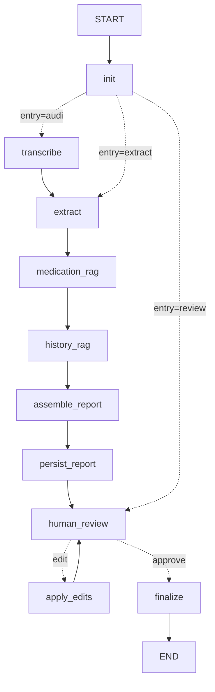

# TeleMed-Scribe — Speech, Audio & Multilingual Processing (Person A)

Speech-to-Text and Multilingual translation pipeline for telemedicine consultations in India (supporting English, Hindi, and Code-mixed clinical dialogue).

## Architecture Overview

```text
Audio (.wav / .mp3 / .m4a)
       │
       ▼
 Audio Preprocessing (pydub / standard 16kHz mono / silence-aware chunking)
       │
       ▼
 faster-whisper (int8 quantization on CPU)
       │
       ▼
 Language Detection
  ├── English ─────────────► Clean English Transcript
  └── Hindi / Code-Mixed ──► NLLB-200 (facebook/nllb-200-distilled-600M) ──► Clean English Transcript
```

## Downstream Interface (Person B & Person D)

```python
from ml.speech import process_consultation_audio

result = process_consultation_audio("consultation.mp3")

# For Person B (T5 Micro-LM Medical Extractor):
english_text = result.translated_text

# For Person D (FastAPI / Streamlit):
response_json = result.to_dict()
```

## Quick Start

### 1. Installation
```bash
pip install -r requirements.txt
```

### 2. Run Tests
```bash
pytest tests/ -v
```

### 3. Run Pipeline Demo
```bash
python demo.py path/to/audio.wavz
```

### 4. Run Evaluation (WER & Medical Term Accuracy)
```bash
python -m evaluation_data.run_evaluation
```

## Orchestration (LangGraph)

`workflow/` wires every stage into one LangGraph state machine. It does not replace any model or DB
code: each node is a thin adapter over `Services` (STT, extractor, RAG) and `Store`, so the existing
test doubles and error mapping (404 / 422 / 409) work unchanged. The original stage endpoints still exist.



| Node | Wraps | Writes to Mongo |
|---|---|---|
| `init` | consultation checks, overwrite guard | – |
| `transcribe` | Person A: `Services.transcribe` (preprocess → Whisper → detect → NLLB) | transcript |
| `extract` | Person B: `Services.extract` | extraction |
| `medication_rag`, `history_rag` | Person C: RAG | – (pure) |
| `assemble_report` | Person D: `build_draft_report` + quality warnings | – (pure) |
| `persist_report` | | medications, draft report (`pending_review`) |
| `human_review` | **pauses** (`interrupt`) until the doctor responds | – |
| `apply_edits`, `finalize` | `Store.update_report`, `Store.finalize_report` | report |

**Endpoints**

```text
POST /consultations/{cid}/workflow/run      audio file (optional) -> draft report; pauses for review
POST /consultations/{cid}/workflow/review   {"action":"edit","edits":{...}}  |  {"action":"approve","approved_by":"Dr X"}
GET  /consultations/{cid}/workflow          DB status + step trace of the last run
GET  /workflow/graph                        Mermaid source of the compiled graph
```

**CLI:** `python demo_workflow.py --stub` (instant, no models) or `python demo_workflow.py audio.mp3`.

**Design notes**
- MongoDB is the source of truth. The checkpointer is in-memory and only remembers the review pause; if it is
  lost (restart, another worker, a failed resume) the review is re-attached from the `pending_review` report.
- Quality warnings (low language confidence, machine-translated transcript, empty extraction) are added to
  `clinical_summary.warnings` for the reviewing doctor; they never block the flow.
- The two RAG nodes run sequentially on purpose: each lazily loads its own embedding model, and loading two
  from parallel threads is flaky.

python -m evaluation_data.run_evaluation
```
